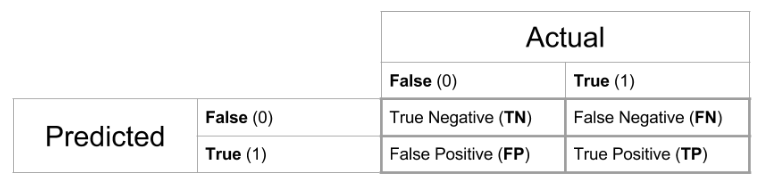

# High Blood Pressure can affect CKD?

## Email : Nemati@UWM.EDU 

This is the repository for a R shiny app that introduces the basics of the main interpretation steps of a logistic regression analysis. You can inspect the app on my [personal Project](https://alinemati.shinyapps.io/CKD-App-main/) or run the app via:

 
 The app uses the classic example: Who survived the titanic? The app shows the main differences between linear and non-linear regression analysis and user explore how passenger's sex, class, and age effects who survived the Titanic.
 

 
 
 you can see some part of application here:
 
 
 ## Class of the Chronic Kidney Disease :
  

## GGPAIRS Plot : 

## Confusion matrix

A confusion matrix is a table that is used to define the performance of a classification algorithm. A confusion matrix visualizes and summarizes the performance of a classification algorithm.

### Confusion matrix result

How well does the model perform?
You are probably aware that R2 is frequently used to evaluate the performance of a linear model. Regrettably, evaluating the performance of a logistic regression is more difficult. There are faux R2 values for logistic regression that can be used to compare nested models, but they cannot be interpreted as explained variance in the same way that they are for linear regression. Rather than that, you might come across two terms: sensitivity and specificity.

Sensitivity considers if our classification of the true outcome was correct. How many persons were classified as having chronic kidney disease (true positives) by our model? The mosaic plot illustrates how many persons developed (or did not develop) CKD; the x-axis represents our observations, while the y-axis represents our prediction. The sensitivity can be calculated by dividing the true positives by the total number of patients with CKD. As a result, the sensitivity equals 0.7142857.

How many people did we classify as not-CKD, who actually did not Chronic kidney disease the class (true negative)? Thus, specificity performs the same function for the negative outcome. If you divide the true negatives by all people who did not survive , you get the specificity. Specificity is 0.704142.

ROC curves are a frequently used technique for combining both indicators. As illustrated in the plot below, a ROC curve plots sensitivity on the y axis and false positive rate (1-specificity) on the x axis. What does the receiver operating characteristic (ROC) curve indicate? By anticipating a binary outcome, we want to accomplish two objectives concurrently: We want to accurately classify the number of persons with CKD, while also wishing for a low rate of false positives. Thus, we desire a sensitivity of 1 and a false positive rate of 0 for our detector (highlighted in black in the ROC curve below). If, on the other hand, the model is unable to forecast the outcome, the ROC curve will be a diagonal line, as a fair coin toss will have the same predictive power. We properly identify persons 50% of the time and make incorrect predictions 50% of the time.

While sensitivity and specificity are not the sole indicators of performance, it is worth noting that the further the ROC curve is from the diagonal (and closer to the black line), the stronger the model's explanatory power.

## Logestic Regression result

Logistic regression, but why?
There are various reasons for the invention of logistic regressions to predict binary outcomes. The most obvious cause is depicted in the figure below. Consider inserting a regression line to represent a binary outcome. Consider the appearance of a scatter plot in such a situation.

In linear regression, we attempt to fit a line that minimizes the error, but the observed error is not homoscedastic in the case of a binary outcome. Additionally, the variance of the error term is dependent on the value of X, yet we observe just zero or one.

Between zero and one, there are no data, despite the fact that we employ a regression line to represent the relationship between the two result values. The following result illustrates the distribution of a logistic and a probit function.

Both distributions are frequently employed in the social sciences to model binary outcomes. Of course, we may alter the first scatter plot and use a logit function rather than a regression line to illustrate the relationship between X and Y.

The scatter plot was generated using simulated data, which is why it appears beautiful and smooth, but I hope you get a sense of the difference between linear and logistic regression.

