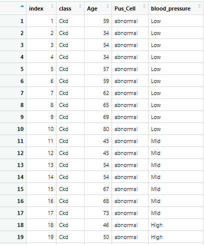
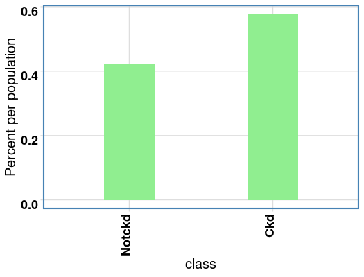
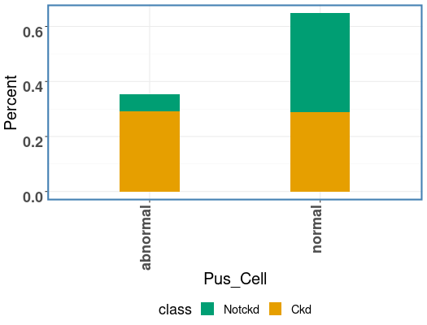
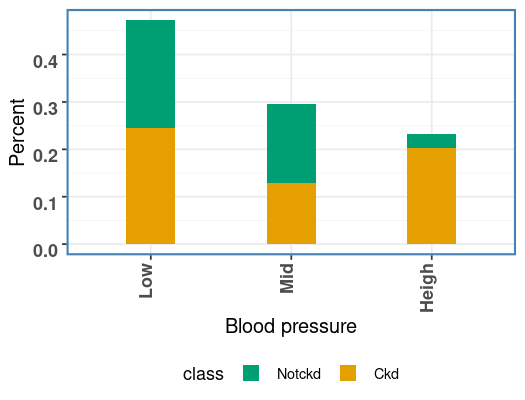
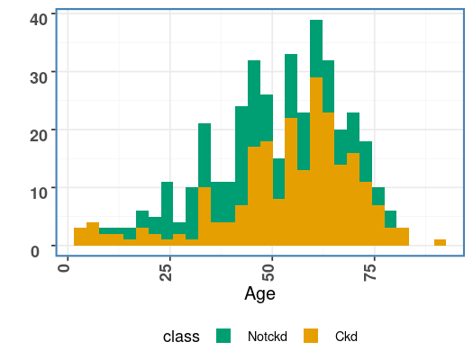
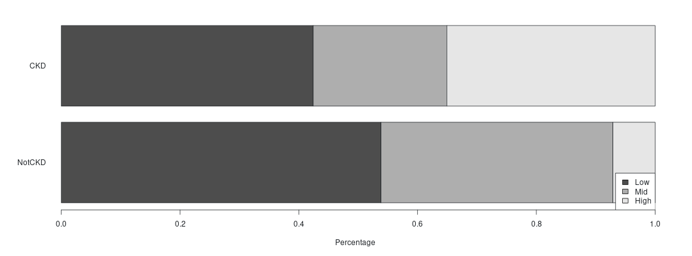

# Report

Instructor: DR. Kourosh Ravvaz

By : Ali Nemati

UWM

Spring 2022

This app illustrates some fundamental concepts in logistic regression. We use Pus Cell, Age, and Blood Pressure to estimate the effect on the Chronic Kidney disease database. 

1- Age

2- Blood Pressure:

Blood Pressure: Low : 80 or less

Blood Pressure: Mid : 80- 120

Blood Pressure: High : 120 or Above

3- Pus Cell: It consists of a buildup of dead, white blood cells that form when the body's immune system responds to the infection

4- Class: CKD =1, NotCKD=0

Class of the Chronic Kidney Disease :

Chronic Kidney Disease Class by Pus Cell:

Blood Pressure by the Chronic Kidney Disease:

Chronic Kidney Disease by Age:

Hypertension is both a cause and result of chronic kidney disease (CKD) and affects the great majority of people with the disease. Controlling hypertension is critical in patients with CKD because it results in a slower course of the disease and a decreased risk of CVD. How many people have Chrinic Kidney diease? Who have a higher change to get Chrinic Kidney diease? what about Pus Cell & Age? On the left side you can see simple bar chart to get a first impression.

\newpage
# Test of Independence

H0: There is no association of one unit increase in blood pressure with chronic kidney disease risk.

H1: There is association of one unit increase in blood pressure with chronic kidney disease risk.

Our Result is :

Because the P-value is clearly less than a = 0.05, we reject H0 and conclude that 
high blood pressure and Chronic Kidney disease are associated in the population. 

\newpage
# Ref:

1. In-class Dr. Kourosh Ravvaz content, UWM, Spring 2022.

2. <https://r4ds.had.co.nz/factors.html#:~:text=In%20R%2C%20factors%20are%20used,to%20work%20with%20than%20characters.>

3. <https://www.youtube.com/watch?v=xkRBfy8_2MU>

4.  <https://r-coder.com/set-seed-r/>

5.  <https://rmd4sci.njtierney.com/math.html>

6.  <https://rpruim.github.io/s341/S19/from-class/MathinRmd.html>

7. <https://www.statology.org/interpret-glm-output-in-r/>

7.  <https://bookdown.org/yihui/rmarkdown-cookbook/update-date.html>

8. <https://stats.oarc.ucla.edu/r/dae/logit-regression/>

9. <https://r-graph-gallery.com/boxplot.html>

10. <https://www.rdocumentation.org/packages/ggplot2/versions/1.0.1/topics/geom_bar>

11. <https://www.jmlr.org/papers/volume20/17-334/17-334.pdf>

12. <https://www.rdocumentation.org/packages/olsrr/versions/0.5.3>

13. <https://cran.r-project.org/web/packages/olsrr/vignettes/variable_selection.html>

14. <https://www.statisticshowto.com/probability-and-statistics/regression-analysis/rmse-root-mean-square-error/>

15. <https://www.machinelearningplus.com/machine-learning/complete-introduction-linear-regression-r/>

16. <https://www.machinelearningplus.com/machine-learning/complete-introduction-linear-regression-r/>

17. <https://www.geeksforgeeks.org/applying-a-function-over-an-object-in-r-programming-sapply-function/>

18. <https://www.statology.org/stepwise-regression-r/>

19. <https://r-statistics.co/Model-Selection-in-R.html>

\newpage
The best way to predict the future is to create it." Abraham Lincoln.

End of Document.
